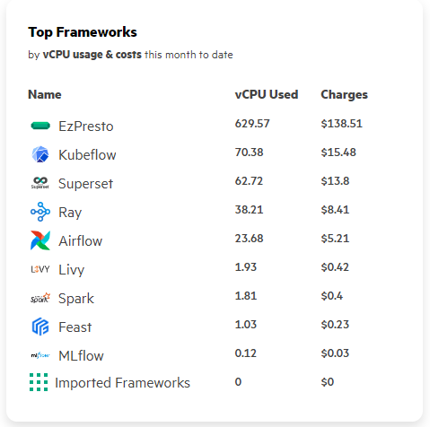

# Observability

### 計量與計費

運用Prometheus監控 Kubernetes 集群中關鍵資源（如 Pod、PVC 和 Jobs）。 提供靈活的查詢語言 (PromQL) 來檢索和分析指標。平台中有許多元件如 Kubeflow、Airflow 等。計量是指跟踪組件的資源使用情況。

.png>)

### 追蹤指標

#### 核心工作負載

包括Notebook Controller、EzPresto核心查詢和Inference Controller。

#### 用戶工作負載

包括Notebook、Inference Job、Spark Job等。

#### 基礎設施工作負載

核心平台功能，例如監視 UI、管理用戶、連接到 Data Fabric 等。

#### 自行導入應用工作負載

手動導入應用程式。您必須在工作負載資源 yaml 文件中手動指定工作負載的標籤。

使用以下標籤配置資源Metadata：

* `hpe-ezua/type="vendor-service"`
* `hpe-ezua/app="<name_of_the_app>"`
